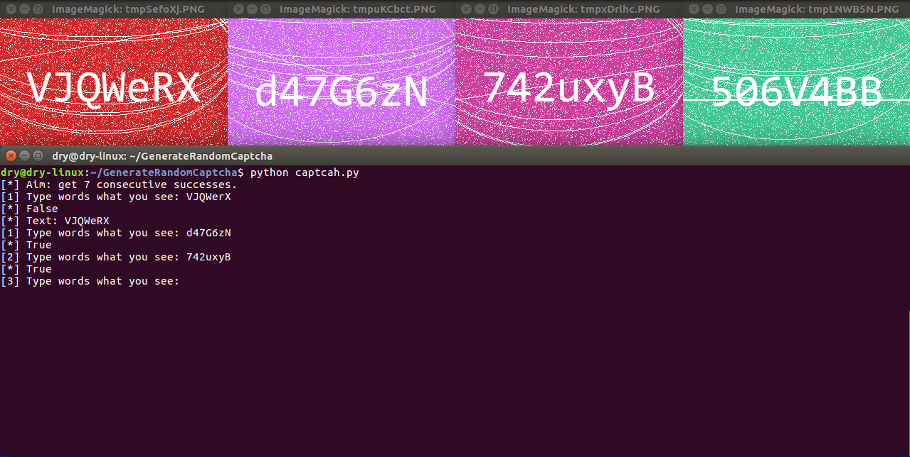

# Generate Random Captcha

>**In many situations, you will need to generate a random captcha to distinguish between humans or robots. For example, it's naturaly to have a captcha when new user register an account. It's luck that python is very suitable for doing that.**
&emsp;&emsp;&emsp;&emsp;&emsp;&emsp;&emsp;&emsp;&emsp;&emsp;&emsp;&emsp;&emsp;&emsp;&emsp;&emsp;&emsp;&emsp;&emsp;&emsp;&emsp;&emsp;&emsp;&emsp;&emsp;&emsp;&emsp;&emsp;&emsp;&emsp;&emsp;&emsp;&emsp;&emsp;&emsp;&emsp;&emsp;&emsp;&emsp;&emsp;&emsp;

## Preparation
### Env & OS
**The following configuration is suitable for me but not necessary for you. After all, it's important to make a decision which is suitable for yourself.**

Key | Value
--- | ---
Environment | Python2.7
Operating System | Ubuntu-LTS-16.04 X64

### Dependence
**Install `python-pip` and `Pillow` if you don't have it.**
```shell
$ sudo apt install python-pip
$ pip install Pillow            # If your system is 32-bit, `PIL` is available,  if not, you'll use `Pillow` instead of `PIL` 
```

### Font File
**Install font file, take `consola` as an example.**
[Download suitable font file from here to linux.](https://code.google.com/archive/p/uigroupcode/downloads)

```shell
$ unzip YaHei.Consolas.1.12.zip                                     # unzip font file
$ mv YaHei.Consolas.1.12.ttf consola.ttf
```
**You can add it to the system font file and activate it, even if this is not necessary for this program.**
```shell
$ sudo mkdir /usr/share/fonts/consola/                              # make folder for font file
$ sudo cp Fonts/consola.ttf /usr/share/fonts/consola/
$ cd /usr/share/fonts/consola/
$ sudo mkfontscale && sudo mkfontdir && sudo fc-cache -fv           # activate font file
```

## Result



## Conclusion

> As well konwn, captcha includeing lower case, upper case and number is normal. And case of typing is ignored is default is also natural.
The above is my biggest change to the program, other little change includes name of method and main method. 
That's all. Thanks.
